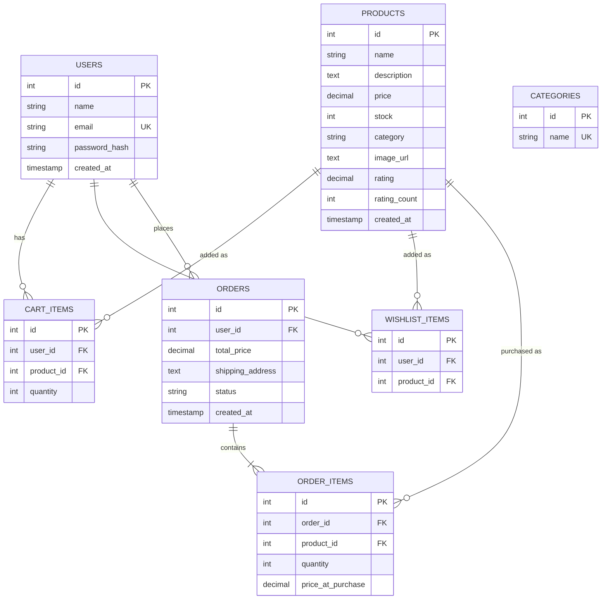

# Amazon Clone — Full-Stack E-Commerce Platform

A functional e-commerce web application that replicates Amazon's design and user experience, built as an SDE Intern Fullstack Assignment. The application includes product browsing, cart management, order placement, user authentication, wishlists, order history, and email notifications.

---

## 🛠️ Tech Stack

| Layer | Technology |
|-------|------------|
| **Frontend** | React.js 18, Vite, Zustand (State Management), React Router DOM v6, Vanilla CSS, Lucide React (Icons) |
| **Backend** | Node.js, Express.js |
| **Database** | PostgreSQL |
| **Caching** | Redis (JWT token blacklisting on logout) |
| **Authentication** | JWT (JSON Web Tokens), bcryptjs (Password Hashing) |
| **Validation** | express-validator |
| **Email** | Nodemailer (Gmail OAuth2) |

---

## ✅ Implemented Features

### Core Features

1. **Product Listing Page**
   - Product grid layout matching Amazon's design
   - Product cards with Image, Name, Price, Rating, Stock Status, and Add to Cart button
   - Search functionality with live autocomplete suggestions (debounced with keyboard navigation)
   - Filter by category (sidebar + navbar links)
   - Filter by price range
   - Sort by: Featured, Price (Low/High), Rating

2. **Product Detail Page**
   - Image carousel with clickable thumbnail strip
   - Breadcrumb navigation (Home → Category → Product)
   - Product description and specifications table
   - Price with MRP strikethrough and discount display
   - Stock availability with live count
   - Quantity selector and Add to Cart button
   - Buy Now button (direct checkout)
   - Amazon-style trust icons (Returns, Free Delivery, Warranty, Pay on Delivery)

3. **Shopping Cart**
   - View all items added to cart
   - Update product quantity with +/- controls
   - Remove items from cart
   - Cart summary with subtotal, item count, and free delivery indicator
   - Slide-in cart sidebar with backdrop overlay on Add to Cart

4. **Order Placement**
   - Multi-step checkout page (Shipping Address → Payment Method → Review Items)
   - Shipping address form with validation
   - Order summary review before placing order
   - Place order with atomic database transaction (stock decrement + order creation)
   - Order confirmation page displaying Order ID and estimated delivery

### Bonus Features

- **Responsive Design** — Mobile, tablet, and desktop layouts via CSS media queries
- **User Authentication** — Login/Signup with JWT, HttpOnly cookies, and Redis token blacklisting for secure logout
- **Order History** — View past orders with expandable item details and Buy Again functionality
- **Wishlist** — Add/remove products, dedicated wishlist page, heart toggle on product cards
- **Email Notification** — Automated email on order placement and order status changes (via Gmail OAuth2)

---

## 🚀 Setup Instructions

### Prerequisites

- [Node.js](https://nodejs.org/) (v16 or higher)
- [PostgreSQL](https://www.postgresql.org/) (running locally or hosted)
- [Redis](https://redis.io/) (locally or via a cloud service like Redis Cloud)

### 1. Clone the Repository

```bash
git clone <your-repository-url>
cd Amazon
```

### 2. Backend Setup

```bash
cd backend
npm install
```

Create a `.env` file in the `backend/` directory:

```env
PORT=5000
DATABASE_URL=postgres://<username>:<password>@localhost:5432/amazon_clone
JWT_SECRET=your_jwt_secret_key
REDIS_HOST=127.0.0.1
REDIS_PORT=6379
REDIS_PASSWORD=
CLIENT_URL=http://localhost:5173

# Optional — Email notifications (Gmail OAuth2)
GOOGLE_CLIENT_ID=
GOOGLE_CLIENT_SECRET=
GOOGLE_REFRESH_TOKEN=
GOOGLE_USER=
```

Initialize the database (creates tables and seeds ~108 products across 9 categories):

```bash
npm run db:init
```

Start the backend server:

```bash
npm run dev
```

### 3. Frontend Setup

Open a new terminal:

```bash
cd frontend
npm install
npm run dev
```

The app will be running at `http://localhost:5173`.

### Default Test User

After running `db:init`, a default user is seeded:

| Field | Value |
|-------|-------|
| Email | `piyush@amazon.in` |
| Password | `password123` |

---

## 📂 Project Structure

```
Amazon/
├── backend/
│   ├── src/
│   │   ├── config/           # Database (PostgreSQL) and cache (Redis) configuration
│   │   ├── controllers/      # Route handlers (auth, product, cart, order, wishlist)
│   │   ├── db/               # Database initialization and seed generation
│   │   ├── middleware/       # Auth (JWT verification) and global error handler
│   │   ├── models/           # SQL data access layer + schema.sql + seed.sql
│   │   ├── routes/           # Express route definitions
│   │   ├── services/         # Business logic layer (order processing, email)
│   │   └── validators/       # Input validation (express-validator)
│   ├── server.js             # Application entry point
│   └── package.json
│
├── frontend/
│   ├── src/
│   │   ├── app/              # App shell, routing, Zustand store, Axios config, CSS
│   │   ├── features/
│   │   │   ├── auth/         # Login/Signup pages, auth hooks, Protected route
│   │   │   ├── cart/         # Cart page, Checkout page, Cart sidebar, hooks
│   │   │   ├── products/    # Home, Search, Product Detail pages, components
│   │   │   ├── orders/      # Order History, Order Confirmation pages
│   │   │   └── wishlist/    # Wishlist page, hooks
│   │   ├── shared/           # Navbar and Footer components
│   │   └── main.jsx          # React entry point
│   ├── index.html
│   ├── vite.config.js
│   └── package.json
│
└── README.md
```

---

## 🗄️ Database Schema

7 tables with proper foreign key relationships, cascade rules, and performance indexes.



### Key Design Decisions

- **`price_at_purchase`** in `order_items` preserves the price at the time of order, so future price changes don't affect historical orders.
- **`UNIQUE(user_id, product_id)`** constraints on `cart_items` and `wishlist_items` prevent duplicate entries.
- **`ON DELETE CASCADE`** on cart and wishlist items ensures cleanup when a user or product is removed.
- **`ON DELETE SET NULL`** on `orders.user_id` preserves order records even if a user account is deleted.
- **PostgreSQL transactions** wrap order creation with atomic stock decrement (`UPDATE ... WHERE stock >= quantity`) to prevent overselling.
- **Performance indexes** on `user_id`, `order_id`, `category`, and `product name` columns.

---

## 🔗 API Endpoints

### Auth
| Method | Route | Auth | Description |
|--------|-------|------|-------------|
| POST | `/api/auth/register` | No | Register new user |
| POST | `/api/auth/login` | No | Login and receive JWT |
| GET | `/api/auth/me` | Yes | Get current user profile |
| POST | `/api/auth/logout` | Yes | Logout and blacklist token |

### Products
| Method | Route | Auth | Description |
|--------|-------|------|-------------|
| GET | `/api/products` | No | List products (search, category, sort, price filters) |
| GET | `/api/products/categories` | No | Get all distinct categories |
| GET | `/api/products/suggestions?q=` | No | Search autocomplete suggestions |
| GET | `/api/products/:id` | No | Get single product details |

### Cart
| Method | Route | Auth | Description |
|--------|-------|------|-------------|
| GET | `/api/cart` | Yes | Get user's cart items |
| POST | `/api/cart` | Yes | Add item to cart |
| PUT | `/api/cart/:id` | Yes | Update cart item quantity |
| DELETE | `/api/cart/:id` | Yes | Remove item from cart |

### Orders
| Method | Route | Auth | Description |
|--------|-------|------|-------------|
| POST | `/api/orders` | Yes | Place order (cart checkout or direct Buy Now) |
| GET | `/api/orders` | Yes | Get order history |
| GET | `/api/orders/:id` | Yes | Get single order details |
| PATCH | `/api/orders/:id/status/:status?` | Yes | Update order status |

### Wishlist
| Method | Route | Auth | Description |
|--------|-------|------|-------------|
| GET | `/api/wishlist` | Yes | Get user's wishlist |
| POST | `/api/wishlist` | Yes | Add item to wishlist |
| DELETE | `/api/wishlist/:id` | Yes | Remove item from wishlist |

---

## 🏗️ Architecture Highlights

1. **Feature-Based Frontend Architecture** — Each domain (auth, cart, products, orders, wishlist) is self-contained with its own pages, hooks, services, and components.
2. **4-Layer Backend** — `Routes → Controllers → Services → Models` with clear separation of concerns.
3. **Zustand State Management** — Lightweight global state for auth, cart, and wishlist with individual selectors to prevent unnecessary re-renders.
4. **Transaction-Safe Orders** — Order placement uses a dedicated PostgreSQL client with `BEGIN/COMMIT/ROLLBACK` wrapping stock validation, order creation, and cart clearing.
5. **Lazy Loading** — All page components are loaded via `React.lazy` with `Suspense` fallback for faster initial load.
6. **Input Validation** — Server-side validation on all mutating endpoints using `express-validator`.
7. **Global Error Handling** — Express error middleware catches all thrown errors and returns standardised JSON responses.

---

## 📝 Assumptions

- A default seeded user (`piyush@amazon.in` / `password123`) is available for immediate testing.
- Product images are sourced from Unsplash CDN URLs.
- The image carousel on the Product Detail page generates variations from a single image URL (the database stores one image per product).
- Email notifications require Gmail OAuth2 credentials in the `.env` file; the app functions normally without them (emails are silently skipped).
- Payment processing is simulated — no real payment gateway is integrated.
- Redis is used exclusively for JWT token blacklisting on logout; the app remains functional without Redis (logout revocation will not work).
